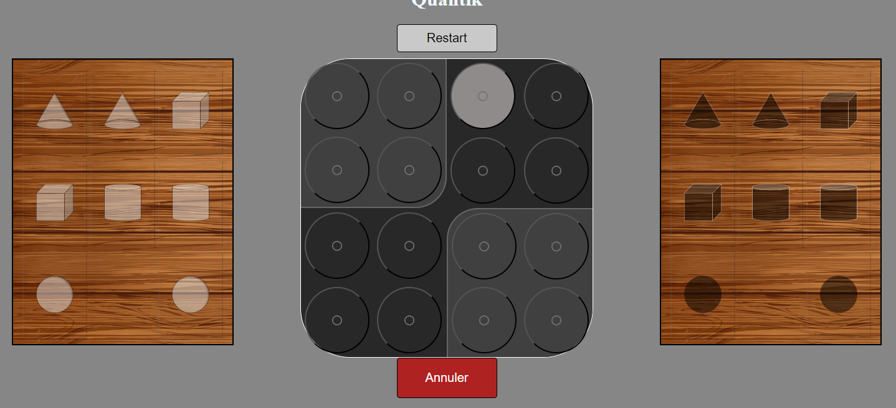

# Quantik
Université Le Havre Normandie

<ul>
    <li>
    ALONSO TORT Andoni
    </li>
    <li>
    BARTON Mathieu
    </li>
</ul>

Un jeu de quantik developpé en PHP.

Si vous voulez connaître un peu mieux le jeu et les régles, [clickez ici](https://www.youtube.com/watch?v=Ft-4FJpZG7Q).

<h2>Images</h2>

Select your pice

Place it on the table

Now is time to black

<i>Developpé en PHP</i>